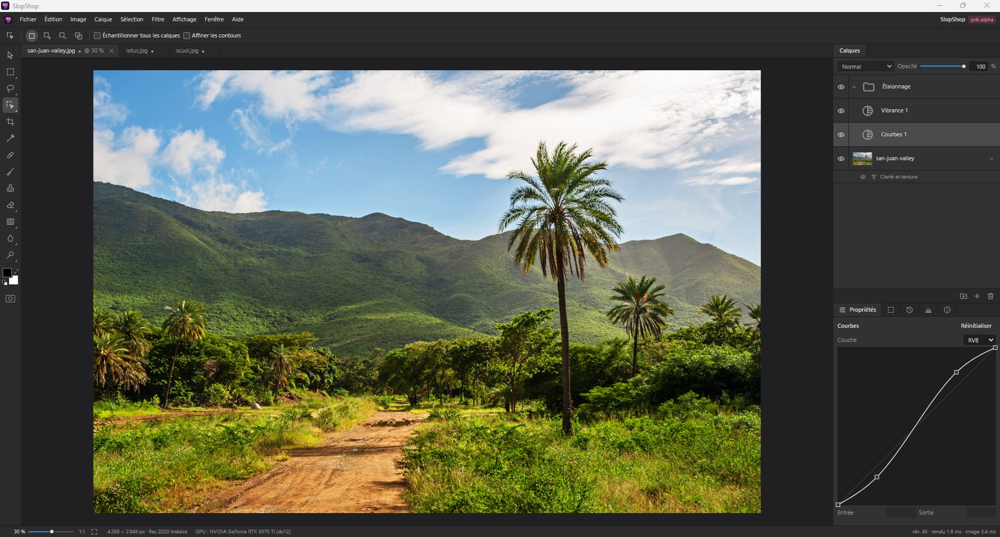
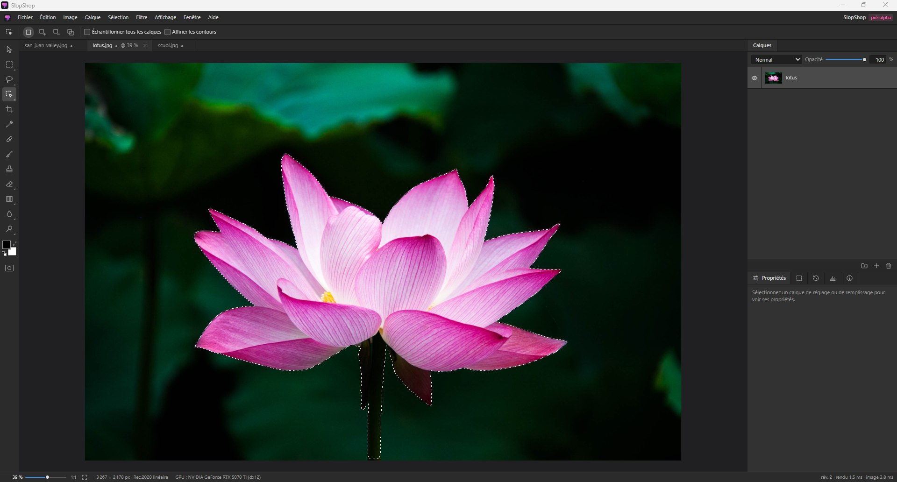
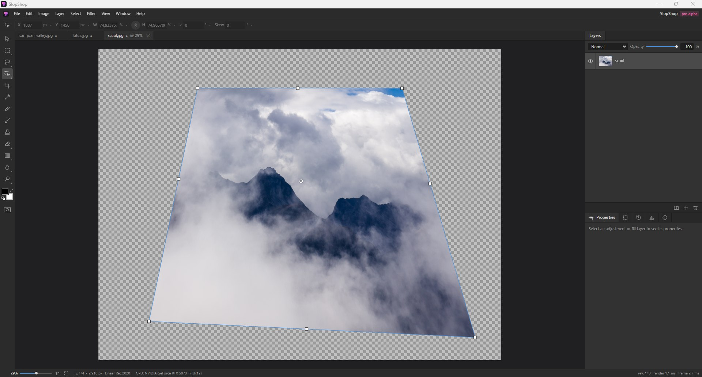
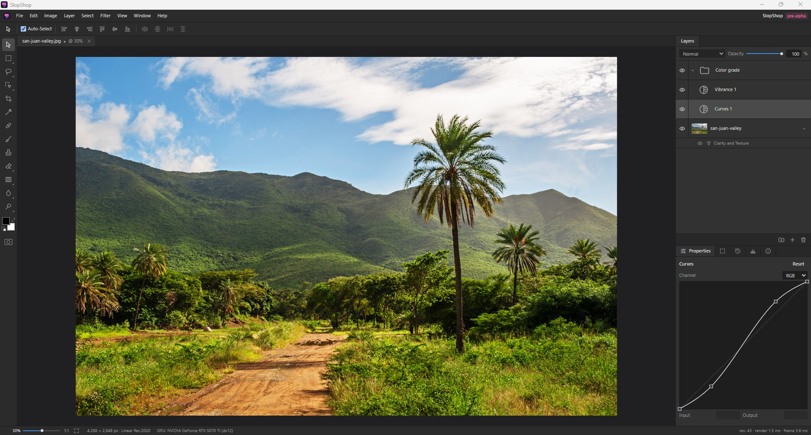

# SlopShop

> A modern, open-source image editor for creating professional-grade slop — non-destructive,
> GPU-accelerated, and AI-native.

The name is a joke. The engineering is not.

<details>
<summary><strong>Version française</strong> : cliquez ici pour lire cette page en français</summary>

> Un éditeur d'images moderne et open source pour créer du slop de qualité professionnelle :
> non destructif, accéléré par le GPU, et nativement IA.

Le nom est une blague. L'ingénierie, non.



> **Remarque : SlopShop en est à ses débuts (pré-alpha).** Il permet déjà de vraies retouches : calques,
> sélections, peinture et retouche, réglages, filtres, transformations, et fichiers PSD avec
> leurs calques. Il n'a pas encore de texte ni de formes, son IA générative ne fait que remplir
> une sélection (sous Windows), et il a quelques défauts de jeunesse : gardez une copie des
> fichiers qui comptent pour vous, et
> [signalez ce qui ne marche pas](https://github.com/laBoiteBleue/slopshop/issues/new/choose)
> (en anglais ou en français).

## Télécharger

La dernière version, pour chaque système :

| Système                               | Téléchargement                                                                                                                                                                                             | Testé à la main |
| ------------------------------------- | ---------------------------------------------------------------------------------------------------------------------------------------------------------------------------------------------------------- | --------------- |
| Windows 10 et 11 (64 bits)            | [`.exe`](https://github.com/laBoiteBleue/slopshop/releases/latest/download/SlopShop_x64-setup.exe) (ou [`.msi`](https://github.com/laBoiteBleue/slopshop/releases/latest/download/SlopShop_x64_en-US.msi)) | Oui             |
| macOS, Apple silicon (M1 et suivants) | [`.dmg` Apple silicon](https://github.com/laBoiteBleue/slopshop/releases/latest/download/SlopShop_aarch64.dmg)                                                                                             | **Non**         |
| macOS, Intel                          | [`.dmg` Intel](https://github.com/laBoiteBleue/slopshop/releases/latest/download/SlopShop_x64.dmg)                                                                                                         | **Non**         |
| Linux : Debian, Ubuntu                | [`.deb`](https://github.com/laBoiteBleue/slopshop/releases/latest/download/SlopShop_amd64.deb)                                                                                                             | **Non**         |
| Linux : Fedora, openSUSE              | [`.rpm`](https://github.com/laBoiteBleue/slopshop/releases/latest/download/SlopShop.x86_64.rpm)                                                                                                            | **Non**         |
| Linux : autres distributions (x86-64) | [`.AppImage`](https://github.com/laBoiteBleue/slopshop/releases/latest/download/SlopShop_amd64.AppImage)                                                                                                   | **Non**         |

Ce qui a changé est sur la [page de la dernière version](https://github.com/laBoiteBleue/slopshop/releases/latest) ; les versions
précédentes, sur la [page des versions](https://github.com/laBoiteBleue/slopshop/releases).

Le mainteneur teste uniquement sous Windows. Les versions macOS et Linux sont produites par
l'intégration continue, où les tests du moteur passent sur les deux systèmes, mais personne n'a
encore utilisé l'application sur ces systèmes : vos retours sont les bienvenus, même pour dire
que ça marche.

Les installeurs ne sont pas encore signés : Windows et macOS affichent un avertissement au
premier lancement. Les notes de version expliquent comment le passer sur chaque système.

SlopShop cherche une nouvelle version après son démarrage, une fois par jour au plus, et
l'installe à la demande (Aide > Rechercher des mises à jour) ; la vérification se désactive dans
Édition > Préférences > Mises à jour. La version 0.1.0 ne se met pas à jour elle-même : installez
une version plus récente à la main une fois.

### Configuration minimale

|                               | Minimum                                                                                                                                                        |
| ----------------------------- | -------------------------------------------------------------------------------------------------------------------------------------------------------------- |
| **Système**                   | Windows 10 ou 11 (64 bits) ; macOS 10.13 ou plus récent ; Linux x86-64 avec WebKitGTK 4.1 (Ubuntu 22.04, Debian 12, Fedora 38 ou plus récent)                  |
| **Carte graphique**           | Un GPU avec des pilotes DirectX 12 (Windows), Metal (macOS) ou Vulkan (Linux) ; SlopShop n'utilise que le niveau de base de ces API, puces intégrées comprises |
| **Mémoire**                   | 8 Go de RAM ; 16 Go ou plus pour des images de plusieurs centaines de mégapixels                                                                               |
| **Disque**                    | Environ 100 Mo, plus jusqu'à 1 Go environ pour les modèles d'IA facultatifs                                                                                    |
| **Outils d'IA (facultatifs)** | Windows x64 (DirectML, tout GPU DirectX 12), macOS sur Apple silicon (Core ML), Linux (sur le processeur). Indisponibles sur les Mac Intel.                    |

Les modèles d'IA ne sont pas dans les installeurs : chacun se télécharge à la demande, dans
Édition > Préférences > Composants IA, dans le dossier de données de SlopShop (les notes de version donnent
son emplacement sur chaque système), et peut être supprimé depuis le même panneau.

## Ce qu'il sait faire

- **Calques** : calques de pixels, groupes, masques d'écrêtage, masques de fusion, modes de
  fusion de Photoshop ; calques de réglage (Luminosité/Contraste, Niveaux, Courbes, Exposition,
  Vibrance, Teinte/Saturation, Balance des couleurs, Noir et blanc, Filtre photo, Mélangeur de
  couches, Négatif, Isohélie, Seuil, Courbe de transfert de dégradé, Correction sélective) ;
  calques de remplissage en couleur unie et en dégradé ; styles de calque (ombres, lueurs,
  contour, incrustation couleur) ; fusion et aplatissement, explicites et annulables.
- **Sélections** : rectangle et ellipse, lassos, baguette magique, sélection rapide, plage de
  couleurs ; sélection d’objet et Sélectionner le sujet par IA locale ; Sélectionner et masquer,
  avec affinage des contours ; masque rapide ; modifier, étendre, transformer, enregistrer et
  récupérer des sélections.
- **Peinture et retouche** : pinceau, crayon, gomme et gomme de restauration avec la pression
  du stylet, pot de peinture, dégradé, tampon de duplication, correcteur et pièce, densité −
  et +, goutte d'eau, netteté et doigt ; Édition > Remplir et Contour.
- **Filtres** : flou gaussien et flou directionnel, accentuation, passe-haut, ajout de bruit,
  anti-poussière, clarté et texture, fluidité.
- **Transformations** : déplacement avec magnétisme et repères commentés, alignement et
  répartition, transformation libre avec torsion et perspective, taille de l'image, taille
  de la zone de travail, rotation, recadrage avec redressement, rognage, règles et repères.
- **Fichiers** : ouvre plus de vingt formats dans leur précision d'origine (PNG, JPEG, TIFF,
  WebP, AVIF, JPEG XL, JPEG 2000, OpenEXR, Radiance HDR, DICOM, FITS, SVG, PDF, RAW
  d'appareils photo et d'autres), les PSD et PSB de Photoshop avec leurs calques ; exporte dans
  presque tous, les PSD et PSB avec leurs calques ; enregistre les documents dans le format
  propre de SlopShop, `.slop` (sans perte, incrémental, résistant aux plantages) ; imprime.
  Détails : [docs/formats.md](docs/formats.md) (en anglais).
- **Interface** : les menus, outils et raccourcis de Photoshop, des onglets de documents, les
  panneaux Historique, Histogramme et Infos, en français et en anglais.
- **Sans interface** : une commande `slopshop` fait des rendus et des conversions sans
  l'interface ([docs/cli.md](docs/cli.md), en anglais).

Pas encore : texte, formes, tracés et masques vectoriels ; IA générative au-delà du remplissage
d'une sélection (outil Suppression, remplissage génératif guidé par un texte) ; modules et
scripts ; enregistrement de l'historique d'annulation dans les documents ; la vue native sur macOS. La [carte des fonctionnalités](docs/feature-map.md)
(en anglais) les recense toutes, faites ou non, et la [feuille de route](docs/roadmap.md) dit
ce qui vient ensuite.

## Pourquoi SlopShop

- **Non destructif de bout en bout.** Pas seulement les calques de réglage : les coups de
  pinceau, les filtres et les réglages appliqués à un calque sont des entrées de sa propre
  pile, chacune modifiable à nouveau, masquable et supprimable, au-dessus de pixels qui ne sont
  jamais réécrits. Les transformations repartent toujours de l'original, et un recadrage ne
  supprime rien.
- **Rapide, sur le GPU.** La composition, la plupart des filtres et les pointillés de sélection
  tournent sur le GPU (DirectX 12, Metal, Vulkan via [wgpu](https://wgpu.rs)), vérifiés par
  rapport à une référence sur le processeur. Les images sont découpées en tuiles, avec des
  niveaux de réduction, pour que les documents de centaines de mégapixels restent fluides.
- **Une couleur précise.** Entiers 8 et 16 bits, flottants 16 et 32 bits, HDR ; calques
  composés en lumière linéaire ; profils de couleur intégrés appliqués ; aucune conversion
  silencieuse ou avec perte.
- **Une IA locale et facultative.** Les outils d'IA tournent sur votre machine, après que vous
  avez accepté de télécharger chaque modèle et sa licence. Pas de compte, pas de cloud, aucun
  envoi. Ils ne sont jamais nécessaires pour utiliser l'éditeur.
- **Familier.** Les menus, outils et raccourcis de Photoshop, et les fichiers PSD avec leurs
  calques, en lecture comme en écriture.
- **Un logiciel libre, écrit en Rust.** Un moteur sûr en mémoire qui fonctionne sans
  l'interface, un format de document ouvert, et la liberté d'étudier, de modifier et de
  partager le tout.

### Où il va

Les modèles génératifs travaillent à 1 ou 2 mégapixels ; les images professionnelles en font
50 ou 100. Le pari à long terme de SlopShop est d'appliquer des outils génératifs à de telles
images **sans réduire leur résolution**, et sans toucher aux pixels hors de la zone modifiée.
L'approche n'est pas encore choisie et le sera par l'expérience : voir
[docs/research/hd-generative-ai.md](docs/research/hd-generative-ai.md) (en anglais).

## Captures d'écran

| Sélectionner le sujet par IA locale                                                                                             | Transformation libre en perspective                                                                                      |
| ------------------------------------------------------------------------------------------------------------------------------- | ------------------------------------------------------------------------------------------------------------------------ |
|  |  |

## Compiler depuis les sources

Ce qu'il faut installer :

- [Rust](https://rustup.rs) (stable ; la version exacte est fixée par `rust-toolchain.toml`)
- [Node.js](https://nodejs.org) 24 ou plus, avec npm
- Les dépendances système de Tauri pour votre système : voir les
  [prérequis de Tauri](https://v2.tauri.app/start/prerequisites/) (WebView2 sous Windows, les
  Xcode Command Line Tools sous macOS, WebKitGTK et compagnie sous Linux)
- Sous Windows, le composant C++ ATL de Visual Studio en plus (Visual Studio Installer >
  Modifier > Composants individuels > « C++ ATL for latest build tools ») : le compilateur de
  shaders, DXC, est intégré et en a besoin ([ADR 0019](docs/adr/0019-dxc-shader-compiler.md))

Lancer l'application, ou construire ses installeurs :

```sh
cd app
npm install
npm run tauri dev     # version de développement
npm run bundle        # installeurs pour ce système, dans target/release/bundle/
```

Les commandes de vérification, le fonctionnement interne et l'architecture sont décrits dans
la [version anglaise](#building-from-source), plus bas, et dans
[docs/architecture.md](docs/architecture.md).

## Contribuer

Les contributions sont les bienvenues, du signalement de bug au code : commencez par
[CONTRIBUTING.md](CONTRIBUTING.md) (en anglais, comme le code et les échanges sur le dépôt).
Tester sous macOS et Linux est l'aide la plus précieuse en ce moment. Les questions et les
idées vont dans les [Discussions](https://github.com/laBoiteBleue/slopshop/discussions) ; les
problèmes de sécurité suivent [SECURITY.md](SECURITY.md).

## Langues

Le code et la documentation sont en anglais. L'application est disponible en **français et en
anglais** (Édition > Préférences) ; ajouter une langue revient à ajouter un catalogue de
traduction (voir [ADR 0004](docs/adr/0004-ui-internationalization.md)).

## Licence

Copyright (C) 2026 The SlopShop contributors.

SlopShop est un logiciel libre, distribué sous la licence publique générale GNU, version 3
uniquement (`GPL-3.0-only`). Vous pouvez l'utiliser, l'étudier, le modifier et le redistribuer
selon les termes de cette licence ; les conditions exactes sont dans [LICENSE](LICENSE). Seul
le texte anglais du [README](#license) et de la licence fait foi.

La spécification du format `.slop` ([docs/file-format.md](docs/file-format.md)) est sous
[CC BY 4.0](LICENSES/CC-BY-4.0.txt) et ses fichiers de référence sous
[CC0 1.0](LICENSES/CC0-1.0.txt), pour que d'autres logiciels puissent implémenter le format.

Les dépendances tierces gardent leurs propres licences. Les modèles et moteurs d'IA que
SlopShop peut télécharger à la demande ne font pas partie de SlopShop : chacun a sa propre
licence, affichée avant le téléchargement.

Le nom « SlopShop » et le logo du projet ne sont pas sous licence GPL : les droits éventuels
sur le nom et l'identité visuelle sont distincts de la licence du code.

Les photos des captures d'écran sont dans le domaine public (CC0), issues de Wikimedia
Commons :
[San Juan Valley](https://commons.wikimedia.org/wiki/File:San_Juan_Valley.jpg) par Wilfredor,
[Lotus flower](<https://commons.wikimedia.org/wiki/File:Lotus_flower_(978659).jpg>) par Hong
Zhang, et
[Scuol-Motta Naluns](<https://commons.wikimedia.org/wiki/File:Scuol-Motta_Naluns,_15-09-2023._(actm.)_09.jpg>)
par Agnes Monkelbaan.

SlopShop est un projet indépendant, sans lien avec Adobe, ni approuvé ni soutenu par Adobe.
Adobe et Photoshop sont des marques déposées ou des marques commerciales d'Adobe aux
États-Unis et/ou dans d'autres pays.

</details>



> [!NOTE]
> **SlopShop is at an early stage (pre-alpha).** It already does real editing: layers,
> selections, painting and retouching, adjustments, filters, transforms, and layered PSD files.
> It has no text or shapes yet, its generative AI only fills a selection (on Windows), and
> some rough edges: keep copies of the files
> that matter to you, and please [report what breaks](https://github.com/laBoiteBleue/slopshop/issues/new/choose).

## Download

The latest version, for each system:

| System                              | Download                                                                                                                                                                                                   | Tested by hand |
| ----------------------------------- | ---------------------------------------------------------------------------------------------------------------------------------------------------------------------------------------------------------- | -------------- |
| Windows 10 and 11 (64-bit)          | [`.exe`](https://github.com/laBoiteBleue/slopshop/releases/latest/download/SlopShop_x64-setup.exe) (or [`.msi`](https://github.com/laBoiteBleue/slopshop/releases/latest/download/SlopShop_x64_en-US.msi)) | Yes            |
| macOS, Apple silicon (M1 and later) | [Apple silicon `.dmg`](https://github.com/laBoiteBleue/slopshop/releases/latest/download/SlopShop_aarch64.dmg)                                                                                             | **No**         |
| macOS, Intel                        | [Intel `.dmg`](https://github.com/laBoiteBleue/slopshop/releases/latest/download/SlopShop_x64.dmg)                                                                                                         | **No**         |
| Linux: Debian, Ubuntu               | [`.deb`](https://github.com/laBoiteBleue/slopshop/releases/latest/download/SlopShop_amd64.deb)                                                                                                             | **No**         |
| Linux: Fedora, openSUSE             | [`.rpm`](https://github.com/laBoiteBleue/slopshop/releases/latest/download/SlopShop.x86_64.rpm)                                                                                                            | **No**         |
| Linux: other distributions (x86-64) | [`.AppImage`](https://github.com/laBoiteBleue/slopshop/releases/latest/download/SlopShop_amd64.AppImage)                                                                                                   | **No**         |

What changed is on the [latest version's page](https://github.com/laBoiteBleue/slopshop/releases/latest); earlier versions are on the
[releases page](https://github.com/laBoiteBleue/slopshop/releases).

The maintainer tests on Windows only. The macOS and Linux builds come from continuous
integration, where the engine's tests pass on both systems, but nobody has used the application
there yet: reports are very welcome, even to say that it works.

The installers are not code-signed yet, so Windows and macOS warn before the first launch. The
release notes say how to get past the warning on each system.

SlopShop looks for a new version after it starts, at most once a day, and installs it when asked
(Help > Check for Updates); the check can be turned off in Edit > Preferences > Updates. Version
0.1.0 does not update itself: install a newer version by hand once.

### System requirements

|                         | Minimum                                                                                                                                                  |
| ----------------------- | -------------------------------------------------------------------------------------------------------------------------------------------------------- |
| **Operating system**    | Windows 10 or 11 (64-bit); macOS 10.13 or later; Linux x86-64 with WebKitGTK 4.1 (Ubuntu 22.04, Debian 12, Fedora 38 or later)                           |
| **Graphics**            | A GPU with DirectX 12 (Windows), Metal (macOS) or Vulkan (Linux) drivers; SlopShop needs only the base level of those APIs, integrated graphics included |
| **Memory**              | 8 GB of RAM; 16 GB or more for images of hundreds of megapixels                                                                                          |
| **Disk**                | About 100 MB, plus up to about 1 GB for the optional AI models                                                                                           |
| **AI tools (optional)** | Windows x64 (DirectML, any DirectX 12 GPU), macOS on Apple silicon (Core ML), Linux (on the processor). Not available on Intel Macs.                     |

The AI models are not in the installers: each one is downloaded on request, in Edit >
Preferences > AI components, into SlopShop's data folder (the release notes give its location on each
system), and can be removed from the same panel.

## What it can do

- **Layers**: pixel layers, groups, clipping masks, layer masks, Photoshop's blend modes;
  adjustment layers (Brightness/Contrast, Levels, Curves, Exposure, Vibrance, Hue/Saturation,
  Color Balance, Black & White, Photo Filter, Channel Mixer, Invert, Posterize, Threshold,
  Gradient Map, Selective Color); solid color and gradient fill layers; layer styles (shadows,
  glows, stroke, color overlay); merging and flattening, explicit and undoable.
- **Selections**: marquees, lassos, Magic Wand, Quick Selection, Color Range; Object Selection
  and Select Subject with local AI; Select and Mask with edge refinement; Quick Mask; modify,
  grow, transform, save and load selections.
- **Painting and retouching**: Brush, Pencil, Eraser and Restore Eraser with pen pressure,
  Paint Bucket, Gradient, Clone Stamp, Healing Brush and Patch, Dodge and Burn, Blur, Sharpen
  and Smudge; Edit > Fill and Stroke.
- **Filters**: Gaussian and Motion Blur, Unsharp Mask, High Pass, Add Noise, Dust & Scratches,
  Clarity and Texture, Liquify.
- **Transforms**: Move with snapping and smart guides, Align and Distribute, Free Transform
  with Distort and Perspective, Image Size, Canvas Size, rotation, Crop with Straighten, Trim,
  rulers and guides.
- **Files**: opens more than twenty formats in their native precision (PNG, JPEG, TIFF, WebP,
  AVIF, JPEG XL, JPEG 2000, OpenEXR, Radiance HDR, DICOM, FITS, SVG, PDF, camera RAW and more),
  Photoshop PSD and PSB with their layers; exports to nearly all of them, PSD and PSB with
  layers;
  saves documents in SlopShop's own `.slop` format (lossless, incremental, crash-safe); prints.
  Details: [docs/formats.md](docs/formats.md).
- **Interface**: Photoshop's menus, tools and shortcuts, document tabs, History, Histogram and
  Info panels, English and French.
- **Headless**: a `slopshop` command renders and converts without the interface
  ([docs/cli.md](docs/cli.md)).

Not yet: text, shapes, paths and vector masks; generative AI beyond filling a selection
(the Remove tool, Generative Fill from a prompt);
plugins and scripting; saving the undo history in documents; the native viewport on macOS.
The [feature map](docs/feature-map.md) lists every feature, done or not, and the
[roadmap](docs/roadmap.md) what comes next.

## Why SlopShop

- **Non-destructive all the way down.** Not only adjustment layers: brush strokes, filters and
  adjustments applied to a layer are entries in that layer's own stack, each one editable
  again, hideable and removable, over pixels that are never rewritten. Transforms are always
  resampled from the original, and crops never delete anything.
- **Fast, on the GPU.** Compositing, most filters and the marching ants run on the GPU
  (DirectX 12, Metal, Vulkan through [wgpu](https://wgpu.rs)), checked against a CPU reference. Images are
  tiled, with mip levels, so documents of hundreds of megapixels stay smooth.
- **Precise color.** 8 and 16-bit integer, 16 and 32-bit float, HDR; layers composited in
  linear light; embedded color profiles applied; no silent or lossy conversion.
- **Local, optional AI.** The AI tools run on your machine, after you agree to download each
  model and its license. No account, no cloud, no upload. They are never required to use the
  editor.
- **Familiar.** Photoshop's menus, tools and shortcuts, and layered PSD files in and out.
- **Free software, built in Rust.** A memory-safe engine that runs without the interface, an
  open document format, and the freedom to study, change and share it all.

### Where it is going

Generative models work at 1 to 2 megapixels; professional images reach 50 or 100. SlopShop's
long-term bet is to apply generative tools to such images **without lowering their
resolution**, and without touching the pixels outside the edited area. The approach is still
open and will be decided by experiment: see
[docs/research/hd-generative-ai.md](docs/research/hd-generative-ai.md).

## Screenshots

| Select Subject with local AI                                                                                                 | Free Transform in perspective                                                                          |
| ---------------------------------------------------------------------------------------------------------------------------- | ------------------------------------------------------------------------------------------------------ |
|  |  |

## Building from source

Prerequisites:

- [Rust](https://rustup.rs) (stable; the exact toolchain is pinned by `rust-toolchain.toml`)
- [Node.js](https://nodejs.org) 24+ with npm
- Tauri's system dependencies for your OS: see the
  [Tauri prerequisites](https://v2.tauri.app/start/prerequisites/) (WebView2 on Windows,
  Xcode Command Line Tools on macOS, WebKitGTK and friends on Linux)
- On Windows, Visual Studio's C++ ATL component as well (Visual Studio Installer > Modify >
  Individual components > "C++ ATL for latest build tools"): the shader compiler, DXC, is
  built in and links against it ([ADR 0019](docs/adr/0019-dxc-shader-compiler.md))

Run the desktop app, or build its installers:

```sh
cd app
npm install
npm run tauri dev     # development build
npm run bundle        # installers for this system, in target/release/bundle/
```

Headless CLI:

```sh
cargo run -p slopshop-cli -- gpu
cargo run -p slopshop-cli -- export photo.jpg photo.png
```

Checks (also run by CI):

```sh
cargo fmt --all --check
cargo clippy --workspace --all-targets -- -D warnings
cargo test --workspace
cd app && npm run format:check && npm run check && npm test && npm run build
```

Under the hood: a Rust engine (a workspace of crates that runs headless), GPU rendering with
[wgpu](https://wgpu.rs), a [Tauri 2](https://tauri.app) desktop shell and a
[Svelte 5](https://svelte.dev) + TypeScript interface. The image logic lives in the engine,
never in the interface. Details: [docs/architecture.md](docs/architecture.md) and the decision
records in [docs/adr/](docs/adr/).

## Contributing

Contributions are welcome, from bug reports to code: start with
[CONTRIBUTING.md](CONTRIBUTING.md). Testing on macOS and Linux is the most valuable help right
now. Questions and ideas go to
[Discussions](https://github.com/laBoiteBleue/slopshop/discussions); security problems to
[SECURITY.md](SECURITY.md).

## Languages

The code and documentation are in English. The application is available in **English and
French** (Edit > Preferences); adding a language means adding one translation catalog (see
[ADR 0004](docs/adr/0004-ui-internationalization.md)).

## License

Copyright (C) 2026 The SlopShop contributors.

SlopShop is free software, distributed under the GNU General Public License, version 3 only
(`GPL-3.0-only`). You may use, study, modify and redistribute it under the terms of that
license; see [LICENSE](LICENSE) for the exact conditions.

The specification of the `.slop` format ([docs/file-format.md](docs/file-format.md)) is under
[CC BY 4.0](LICENSES/CC-BY-4.0.txt) and its golden files under [CC0 1.0](LICENSES/CC0-1.0.txt),
so that other software can implement the format.

Third-party dependencies keep their own licenses. The AI models and runtimes that SlopShop can
download on request are not part of SlopShop: each comes under its own license, shown before
the download.

The name "SlopShop" and the project's logo are not licensed under the GPL: any rights in the
name and the branding are separate from the license of the code.

The photos in the screenshots are in the public domain (CC0), from Wikimedia Commons:
[San Juan Valley](https://commons.wikimedia.org/wiki/File:San_Juan_Valley.jpg) by Wilfredor,
[Lotus flower](<https://commons.wikimedia.org/wiki/File:Lotus_flower_(978659).jpg>) by Hong
Zhang, and
[Scuol-Motta Naluns](<https://commons.wikimedia.org/wiki/File:Scuol-Motta_Naluns,_15-09-2023._(actm.)_09.jpg>)
by Agnes Monkelbaan.

SlopShop is an independent project, not affiliated with, endorsed by or sponsored by Adobe.
Adobe and Photoshop are either registered trademarks or trademarks of Adobe in the United
States and/or other countries.
